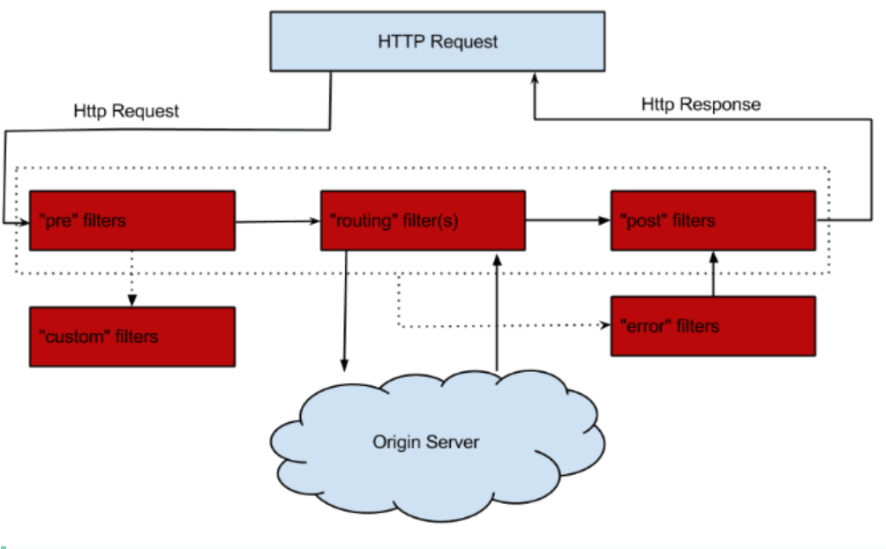

# 工程简介

### zuul配置
###传统配置
```yaml
zuul:
  routes:
    api-a:
      path: /api-a/**
      url: http://localhost:8083/hello
```
通过上面的配置，所有符合/api-a/**规则的访问都将被路由转发到http://localhost:8082/地址上，即当我们向服务网关访问http://localhost:12580/api-a/hello请求的时候，请求将被转发到http://localhost:8082/hello服务上

###基于服务名称配置
```yaml
zuul:
  routes:
    api-b:
      path: /api-b/**
      serviceId: server-provider
    api-c:
      path: /api-c/**
      serviceId: server-consumer
```
#### 默认路由配置规则
```yaml
zuul:
  routes:
    server-provider:
      path: /api-b/**
    server-consumer:
      path: /api-c/**
```

#### 优先级
```yaml
zuul:
  routes:
    api-c:
      path: /api-c/**
      serviceId: server-consumer
    api-d:
      path: /api-c/user/1
      serviceId: lol
```
假如某个请求路径可以和多个路由配置规则相匹配的话，Zuul根据匹配的先后顺序来决定最终使用哪个路由配置.

#### 前缀配置
```yaml
zuul:
  prefix: /gateway
```

#### 本地跳转
```yaml
zuul:
  routes:
    api-e:
      path: /api-e/**
      url: forward:/test
```
Zuul网关除了支持将服务转发到各个微服务上之外，还支持将服务跳转到网关本身的服务上，比如现在yml中有如上一段配置:

# 头部过滤 & 重定向
在使用Zuul网关的时候你可能会遇到Cookie丢失的情况，这是因为默认情况下Zuul会过滤掉HTTP请求头中的一些敏感信息，这些敏感信息通过下面的配置设定：
```yaml
zuul:
  sensitive-headers: Cookie,Set-Cookie,Authorization
```
如果想关闭这个默认配置，通过设置全局参数为空来覆盖默认值：
```yaml
zuul:
  sensitive-headers:
```
如果只想关闭某个路由的HTTP请求头过滤，可以这样：
```yaml
zuul:
 routes:
   api-a:
     sensitive-headers:
```
使用Zuul另一个常见问题是重定向的问题，可以通过下面的设置解决：
```yaml
zuul:
  add-host-header: true
```
# 延伸阅读

## 过滤器

PRE：PRE过滤器用于将请求路径与配置的路由规则进行匹配，以找到需要转发的目标地址，并做一些前置加工，比如请求的校验等；

ROUTING：ROUTING过滤器用于将外部请求转发到具体服务实例上去；

POST：POST过滤器用于将微服务的响应信息返回到客户端，这个过程种可以对返回数据进行加工处理；

ERROR：上述的过程发生异常后将调用ERROR过滤器。ERROR过滤器捕获到异常后需要将异常信息返回给客户端，所以最终还是会调用POST过滤器。

