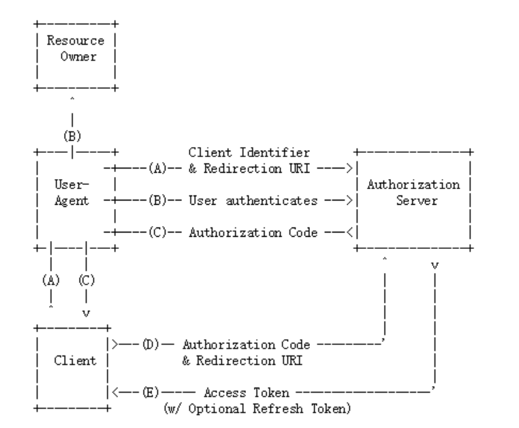
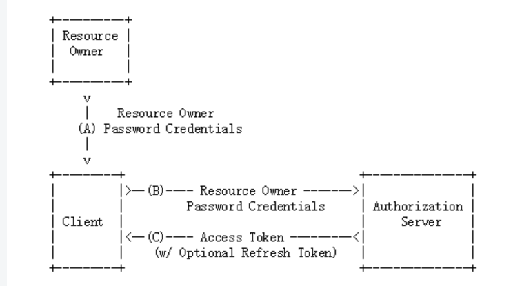

# 工程简介
Spring Security OAuth2入门  自定义token验证方式   自定义令牌配置jwt

# 延伸阅读

# 四种授权模式
在了解这四种授权模式之前，我们需要先学习一些和OAuth相关的名词。举个社交登录的例子吧，比如在浏览器上使用QQ账号登录虎牙直播，
1.Third-party application 第三方应用程序，比如这里的虎牙直播；
2.HTTP service HTTP服务提供商，比如这里的QQ（腾讯）;
3.Resource Owner 资源所有者，就是QQ的所有人，你；
4.User Agent 用户代理，这里指浏览器；
5.Authorization server 认证服务器，这里指QQ提供的第三方登录服务；
6.Resource server 资源服务器，这里指虎牙直播提供的服务，比如高清直播，弹幕发送等（需要认证后才能使用）。

## 授权码模式

A. 客户端将用户导向认证服务器； 
B. 用户决定是否给客户端授权； 
C. 同意授权后，认证服务器将用户导向客户端提供的URL，并附上授权码； 
D. 客户端通过重定向URL和授权码到认证服务器换取令牌； 
E. 校验无误后发放令牌； 

其中A步骤，客户端申请认证的URI，包含以下参数：
1.response_type：表示授权类型，必选项，此处的值固定为”code”，标识授权码模式 
2.client_id：表示客户端的ID，必选项 
3.redirect_uri：表示重定向URI，可选项 
4.scope：表示申请的权限范围，可选项 
5.state：表示客户端的当前状态，可以指定任意值，认证服务器会原封不动地返回这个值。 

D步骤中，客户端向认证服务器申请令牌的HTTP请求，包含以下参数：
1.grant_type：表示使用的授权模式，必选项，此处的值固定为”authorization_code”。 
2.code：表示上一步获得的授权码，必选项 
3.redirect_uri：表示重定向URI，必选项，且必须与A步骤中的该参数值保持一致。 
4.client_id：表示客户端ID，必选项。 

## 密码模式
在密码模式中，用户像客户端提供用户名和密码，客户端通过用户名和密码到认证服务器获取令牌。流程如下所示：

A.用户向客户端提供用户名和密码； 
B.客户端向认证服务器换取令牌； 
C.发放令牌。 
B步骤中，客户端发出的HTTP请求，包含以下参数：
1.grant_type：表示授权类型，此处的值固定为”password”，必选项。 
2.username：表示用户名，必选项。 
3.password：表示用户的密码，必选项。 
4.scope：表示权限范围，可选项。 
