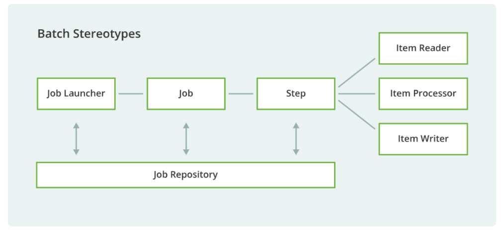

# 工程简介
Spring Batch 批处理

## Spring Batch的组成

Spring Batch里最基本的单元就是任务Job，一个Job由若干个步骤Step组成。任务启动器Job Launcher负责运行Job，任务存储仓库Job Repository存储着Job的执行状态，参数和日志等信息。Job处理任务又可以分为三大类：数据读取Item Reader、数据中间处理Item Processor和数据输出Item Writer。

任务存储仓库可以是关系型数据库MySQL，非关系型数据库MongoDB或者直接存储在内存中，本篇使用的是MySQL作为任务存储仓库。
新建一个名称为springbatch的MySQL数据库，然后导入org.springframework.batch.core目录下的schema-mysql.sql文件：
# 延伸阅读

